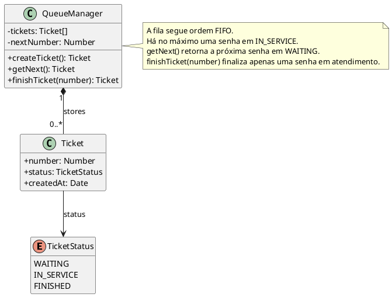

# Diagrama de classes

```plantuml
@startuml
hide empty members
skinparam classAttributeIconSize 0

enum TicketStatus {
  WAITING
  IN_SERVICE
  FINISHED
}

class Ticket {
  +number: Number
  +status: TicketStatus
  +createdAt: Date
}

class QueueManager {
  -tickets: Ticket[]
  -nextNumber: Number
  +createTicket(): Ticket
  +getNext(): Ticket
  +finishTicket(number): Ticket
}

Ticket --> TicketStatus : status
QueueManager "1" *-- "0..*" Ticket : stores

note right of QueueManager
  A fila segue ordem FIFO.
  Há no máximo uma senha em IN_SERVICE.
  getNext() retorna a próxima senha em WAITING.
  finishTicket(number) finaliza apenas uma senha em atendimento.
end note
@enduml
```

