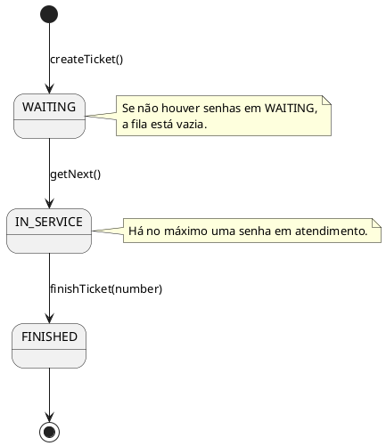

# Diagrama de estados da senha

```plantuml
@startuml
[*] --> WAITING : createTicket()
WAITING --> IN_SERVICE : getNext()
IN_SERVICE --> FINISHED : finishTicket(number)
FINISHED --> [*]

note right of WAITING
  Se não houver senhas em WAITING,
  a fila está vazia.
end note

note right of IN_SERVICE
  Há no máximo uma senha em atendimento.
end note
@enduml
```

